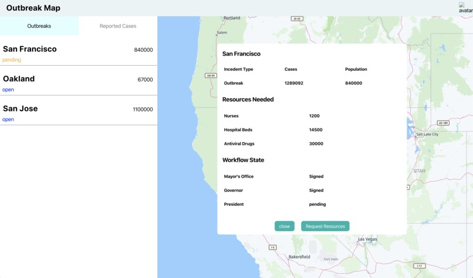

# QuickRelief

## Overview

As part of the 2020 Developer Week, we attended a hackathon of over 600 people and almost 80 teams.  Our team of three had 24 hours to ideate and create an app using DocuSign's envelope product.

We decided to create a single page app that would be government facing and would allow different government bodies to input and track incidents of natural disasters and health crises (i.e.- a wild fire or flu epidemic) through heat maps, and initiate the process of getting approval for aid more quickly.  Our app would allow next-in-line approvers to see where the beaurocracy was holding up the process so they could pressure these parties to act more quickly. The app uses an identification authorization that requires both a known user account and an ID verification for added security.  Once all parties have approved the paperwork, the DocuSign product can initiate a "payments" process to distribute either money or goods or dispatch relief workers to an area.  

In 24 hours, we were able to mock up a prototype, code the UI, and create the DocuSign forms needed to execute this process.  We were not able create databases or handle data entry and utilization in this 24 hours.  

Our team placed 2nd in our particular challenge!

## Mission Statement:
We aim to provide a speedy way for government officials to report cases of natural disaster or potential epidemic through an easy document workflow and visualization/mapping of disaster hot spots and relief zones.

## User Story:
ex. 1000 flu cases in SF where the city needs medical help and food distribution, so they log on a SPA and select the documents that needs to be signed. This will update the map to show the radial location of affected region.

## Tech Stack
-React

-Node.js

-Here Map API

-Docusign API

-Express

## Project Roles
Indya: Wireframing, DocuSign Envelope, DocuSign OAUTH. 

Chi: Backend and App Setup, HERE Map, HERE Geocoding, GIT Guru.

Tyler: UI Coding, Data Flow and State Management, Routing, HERE Map.

## My Lessons Learned

Working collaboratively gave me a lot of perspective about my strengths and areas where I still have room to grow and learn.  I previously thought I had a good grasp on using GIT...I did certainly did not, but I have a better understanding now.  I have learned that I have a decent grasp on styling and using React to make componentized apps.  I feel more confident in my ability to code and keep up with more experienced coders. 

### Our App

### Our Prototype Mockups

.jpg)

.jpg)

.jpg)
